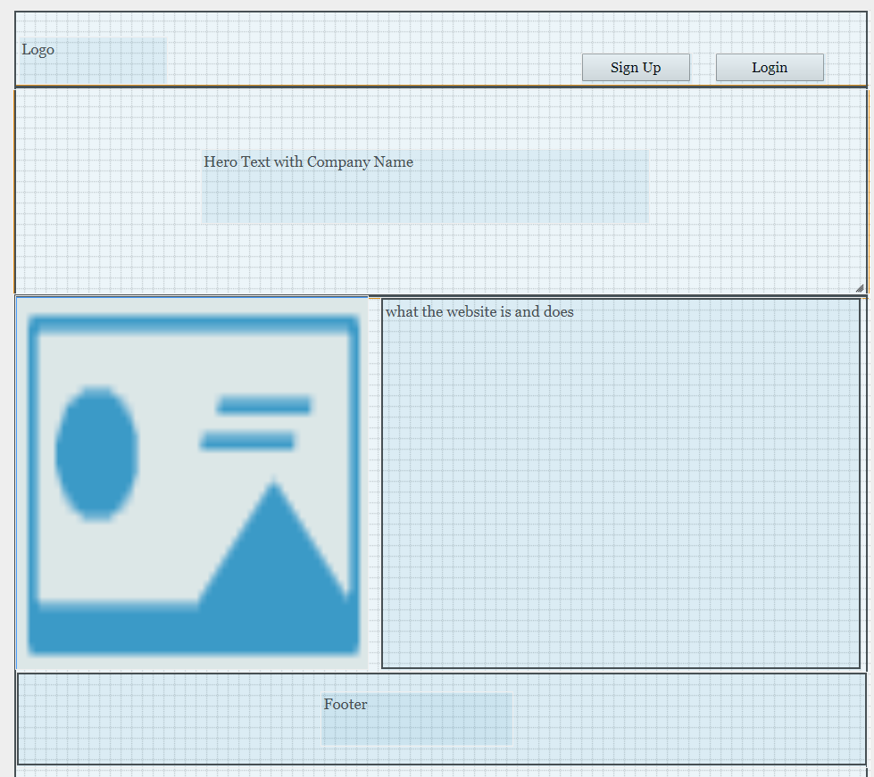
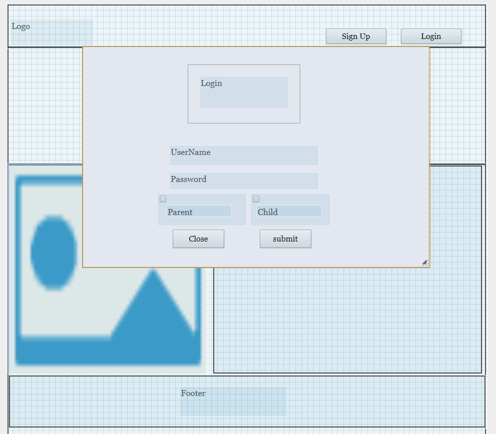
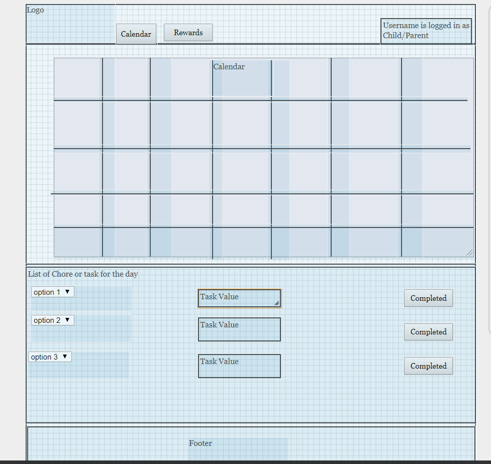
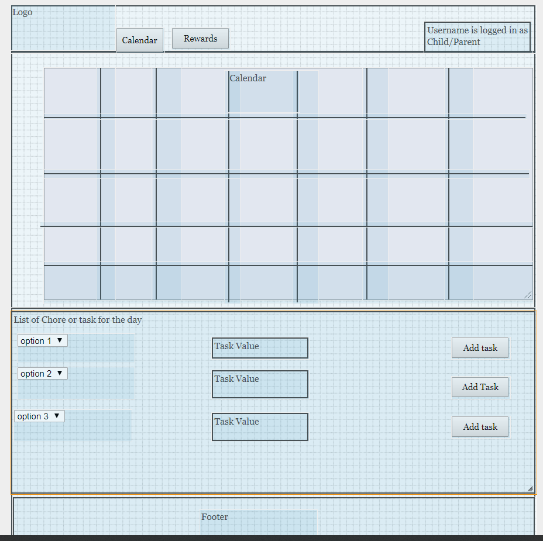
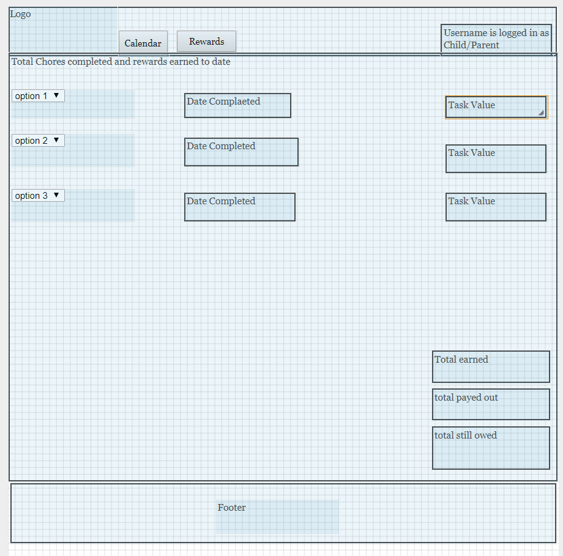
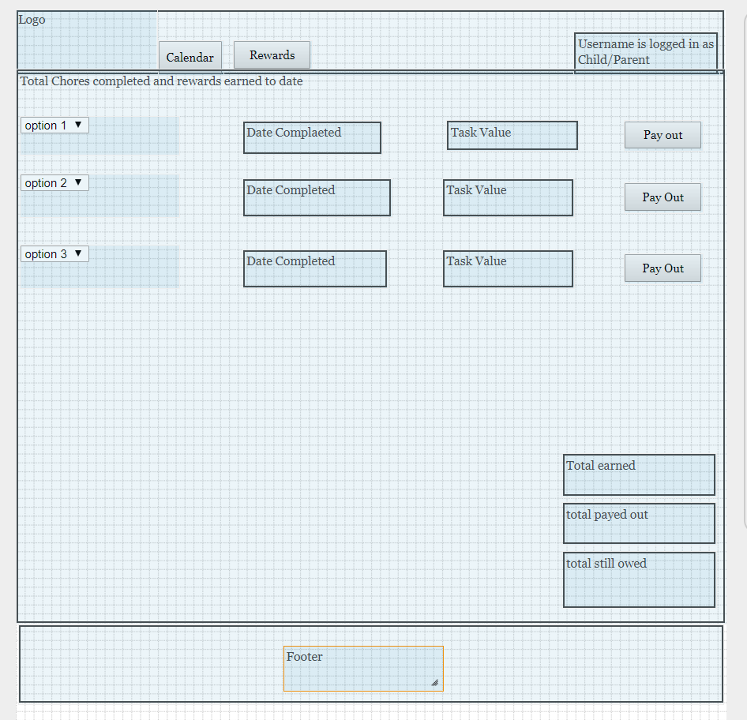
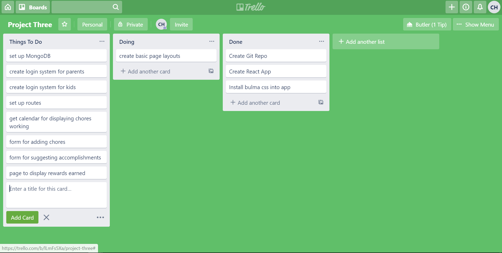

# Choretastic

## Intent of Application 

The intent of the application is to provide parents and children and easy way to manage household chores, while teaching children about finances. The parents will have a way to add chores to a calander and set a value to each chore(some sort of reward). The child will see the list and be able to check off when chore is completed and then have a updated record of his "reward payout". The child will also be able to "suggest" an accomplishment that they are proud of, and the parent can reward that accomplishment.

I think this is a valuable tool to help children learn that hard work isn't always for nothing, and that the hard work they do is appreciated and noticed. Also eventually would like to add more ways to teach kids about being finacially responsible. 

### UI layout

#### This is the main landing page.

 
 
#### Shows sign up modal when user selects to sign up

#### Shows login Modal if user selects to login

#### Once logged in if child is viewing calendar and task

#### or if logged in and parent is viewing calendar

#### if logged in and child is viewing Rewards Page

#### if logged in and parent is viewing Rewards Page

### Group Memebers 

Claude Hatfield - Solo Developer on Project.

### screenshot of project management

